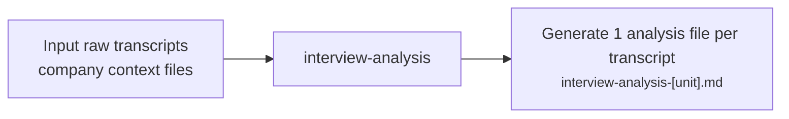

# Interview Analysis

---

## Purpose

Analyses user research interviews for pain points, bright spots, and project-specific dimensions — one file per participant, with verbatim quotes. No synthesis.

---

## Workflow

Takes raw interview transcripts and company context files as input, produces one analysis file per transcript, and feeds into research-synthesis.

---

## Challenges and Iterations

| Challenge | Fix | Result |
|---|---|---|
| Agent **re-typed** quotes from memory after locating them — producing word substitutions (e.g. "redeeming" for "redemption") undetectable without comparing against source. | **Introduced** Quote Registry Protocol: grep opening anchor → `Read` to bound utterance → grep closing anchor → copy verbatim into `quote-registry-[unit].json`; hard gate blocks `.md` until registry is saved. | Output quotes are copied from registry entries, never re-typed — word substitution errors are structurally impossible. |
| Agent re-derived analysis dimensions from the discussion guide at the start of every session — requiring users to re-confirm dimensions already approved in a prior run. | **Added** `analysis-dimensions.md` as a locked file: written once after first confirmation, reloaded automatically on all subsequent sessions for that study. | Dimensions are confirmed once per study; subsequent sessions skip straight to transcript selection. |
| Agent **auto-advanced** through all remaining transcripts with no stopping mechanism — users couldn't pause, redirect, or abort mid-session. | **Added** per-file approval gate (Step 8): agent stops after each file and asks before proceeding; batch mode retained for unattended runs. | Users can stop, redirect, or jump to any transcript after each file. |
| Agent duplicated findings across Pain Points and project-specific dimensions when topics overlapped — inflating apparent finding counts with redundant entries. | **Added** de-duplication rule: findings covered by a project-specific dimension are captured there only, not in Pain Points or Bright Spots. | Each finding appears in exactly one section per transcript. |

---

## Evals

**Method:** [`int-research-eval`](.claude/agents/int-research-eval.md) **Machine-led evaluation**: Conducts **objective** checks (e.g., quote verbatim accuracy, quote relevance, speaker attribution, structural compliance, inference violations, minimum quote count).

### Machine-led Evaluation

Based on latest interview analysis eval (version 2):

| Metric | v1 (U1 · Apr 18) | v2 (U2 · May 06) | Δ (v1→v2) |
|---|---|---|---|
| Auto-fix | 7 | 5 | -2 |
| Flagged | 1 | 2 | +1 |
| Passed | 9 | 9 | — |
| Precision | 100% | 100% | — |
| Recall | 93.8% | 100% | +6.2pp |
| F1 | 96.8% | 100% | +3.2pp |

- **Eval Reports:**
  - [2026-05-06 — HPB interview U2](projects/HPB/06-%20evals/2026-05-06-interview-u2-verification.md)

---

## Sample Output

- [HPB Interview Analysis — U1](projects/HPB/04-%20analysis/HPB-interview-analysis-U1.md)
- [HPB Interview Analysis — U2](projects/HPB/04-%20analysis/HPB-interview-analysis-U2.md)

---

## Outcome

✅ **Accuracy / Quality:** Zero inaccurate findings or missed insights on lastest version, ensuring we don't miss any context in our downstream synthesis. 

✅ **Cost savings:** ~€3,000/year — task reduced from 1 hr to 10 mins (incl. verification) 
*Assumptions: run ~90 transcripts/year · 15 transcripts × 6 projects · pegged to PM salary*

---

## Next step

- Test interview analysis agent on another set of interview transcripts

---

## Link to Agent

- [interview-analysis](.claude/agents/interview-analysis.md) — prompt Claude uses at runtime
