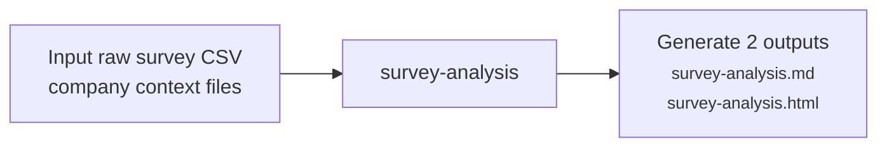

# Survey Analysis

---

## Purpose

Breaks down analysis by survey question and highlights key themes by user segment. It also outputs a link that visualises survey data for stakeholders to understand at a glance.

---

## Workflow

Takes a raw survey CSV and company context files, runs a Python/pandas script to compute all statistics, then produces a markdown report and interactive HTML visualisation ready for synthesis.

---

## Challenges and Iterations

| Challenge | Fix | Result |
|---|---|---|
| Analysis depended on **LLM-computed statistics** which silently produced wrong figures (e.g. dual-channel segment output at 11% instead of the correct 22%). | **Introduced** a Python/pandas script that writes `stats.json` before analysis begins | This deterministic approach ensures every computation is accurate |
| **Demographic skews** were reported without supporting counts — directional claims that looked credible but were unverifiable (e.g. "younger respondents favour X" with no %, no n, no gap size). | **Enforced** mandatory % and n for every segment cited, a 2×MoE reporting threshold, and Rule of 30 — skews only surface when `reportable: true` in `stats.json`. | Unsupported directional claims eliminated; users can understand skews by segment size. |

---

## Evals

**Method:** [`int-research-eval`](.claude/agents/int-research-eval.md) **Machine-led evaluation**: Conducts **objective** checks (quote accuracy, calculation correctness, structural compliance, inference violations).

### Machine-led Evaluation

Based on latest survey analysis eval (version 1):

| Metric | v1 (2026-04-17) |
|---|---|
| Quote accuracy | Pass |
| Calculation correctness | 2 errors auto-fixed |
| Structural compliance | Pass |
| Inference violations | None |
| Items flagged for human review | 0 |

- **Eval Reports:**
  - [2026-04-17 — HPB survey analysis](projects/HPB/06-%20evals/2026-04-17-survey-verification.md)

---

## Sample Output

- [HPB Survey Analysis — Markdown](projects/HPB/04-%20analysis/survey-analysis.md)
- [HPB Survey Analysis — HTML](projects/HPB/04-%20analysis/survey-analysis.html)

---

## Outcome

✅ **Accuracy / Quality:** Machine-led eval caught and auto-fixed 2 calculation errors in v1; stats.json pipeline introduced in v2 to eliminate model arithmetic at source.

✅ **Cost savings:** ~€650/year — task reduced from 3 hrs to 15 mins (incl. verification) 
*Assumptions: run ~6 times/year · one survey analysis per engagement cycle · pegged to PM salary*

---

## Next step

- Test with surveys from other companies 

---

## Link to Agent

- [survey-analysis](.claude/agents/survey-analysis.md) 
